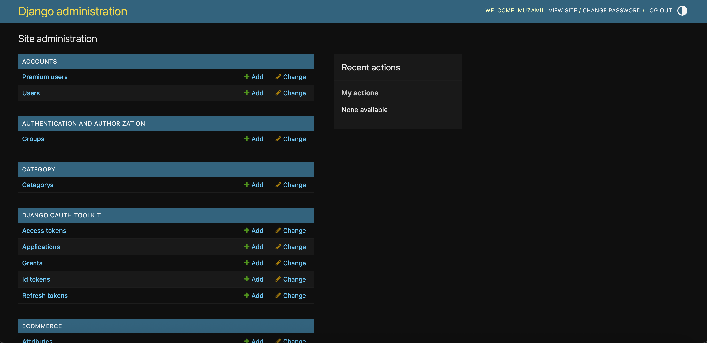
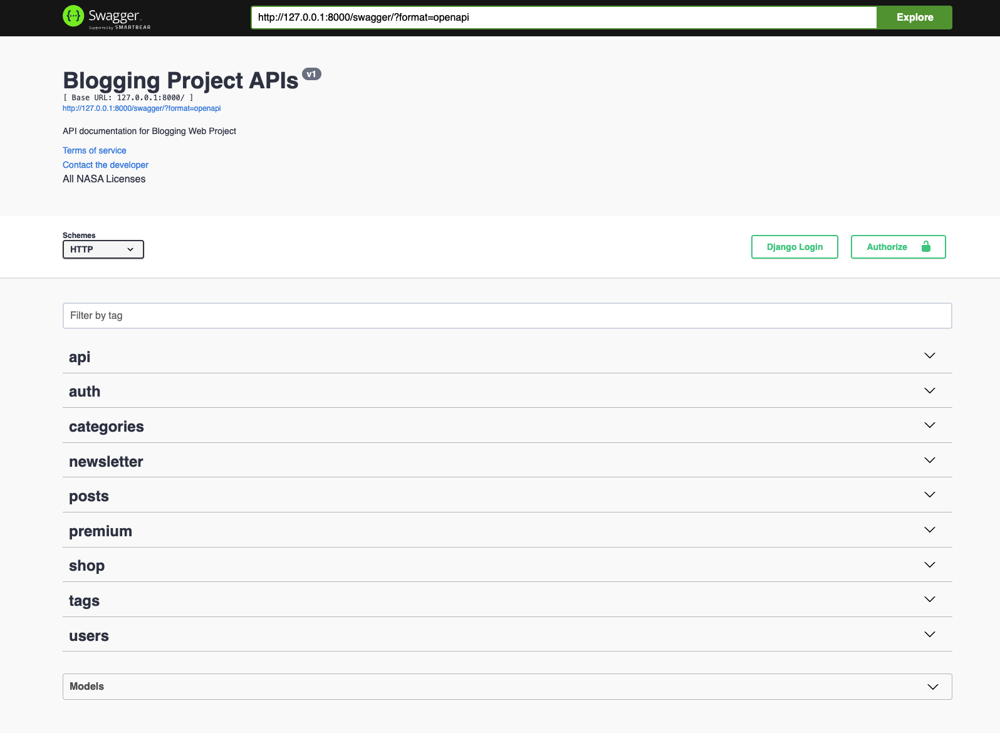
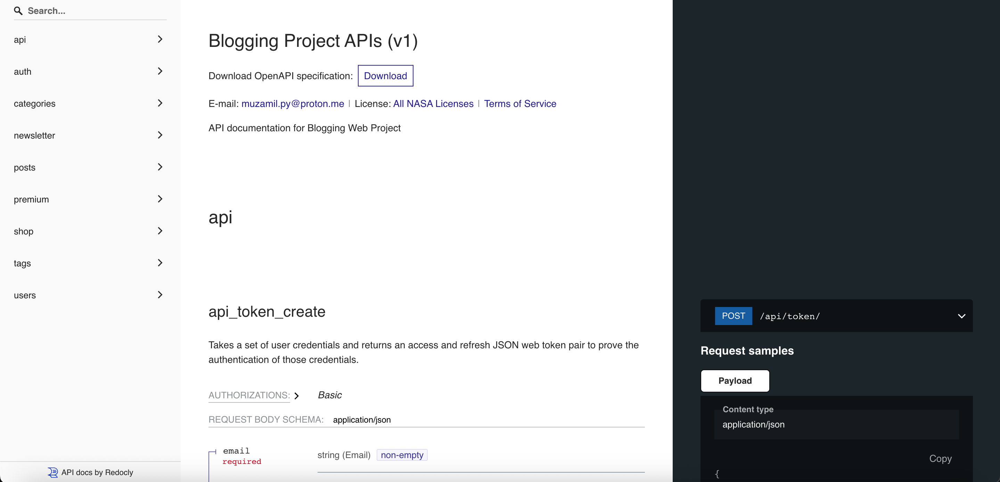

# Blog-Web-Hexaa

Blog-Web-Hexaa is a feature-rich blogging platform that supports user authentication, social login, e-commerce functionality, and premium subscriptions. It is built using Django and integrates various third-party services like Stripe for payments and Redis for caching.

---

## Key Features

### 1. **User Authentication**
- Custom user model (`accounts.CustomUser`) for flexible user management.
- Password reset functionality using `Djoser`.
- Social login support for Google and Facebook via `social-auth-app-django`.

### 2. **Blogging System**
- Users can create, update, and delete posts.
- Support for tagging posts using the `tag` app.
- Commenting and liking functionality for posts.
- Premium posts accessible only to subscribed users.

### 3. **E-commerce Integration**
- Product management (categories, colors, attributes, etc.).
- Order and order item management.
- Payment integration using Stripe.
- Support for both online payments and cash on delivery (COD).

### 4. **Premium Subscriptions**
- Users can subscribe to premium plans via Stripe.
- Premium users gain access to exclusive content and features.

### 5. **WebSocket Notifications**
- Real-time notifications for likes, comments, and new posts using Django Channels.

### 6. **Caching**
- Redis is used for caching to improve performance.

### 7. **REST API**
- Built using Django REST Framework (DRF).
- Token-based authentication using `SimpleJWT`.
- Pagination for API responses.

### 8. **Admin Panel**
- Django admin panel for managing users, posts, orders, and more.

---

## Tech Stack

### Backend
- **Django**: Web framework for rapid development.
- **Django REST Framework (DRF)**: For building RESTful APIs.
- **Djoser**: Simplifies user authentication and management.
- **Django Channels**: Enables WebSocket support for real-time notifications.

### Frontend
- Not included in this repository but designed to integrate with React or any other frontend framework.

### Database
- **SQLite**: Default database for development (can be replaced with PostgreSQL or MySQL for production).

### Payment Gateway
- **Stripe**: For handling online payments and subscriptions.

### Caching
- **Redis**: Used for caching to improve performance.

### Social Authentication
- **Google OAuth2**: For Google login.
- **Facebook OAuth2**: For Facebook login.

### Other Tools and Libraries
- **django-cors-headers**: For handling Cross-Origin Resource Sharing (CORS).
- **python-dotenv**: For managing environment variables.
- **django-redis**: For Redis integration.
- **drf-yasg**: For API documentation with Swagger.

---
## Screenshots
### Django Admin Panel
*Default Admin Panel*


### Swagger API Documentation
*Documentation with Swagger*


### Redocly API Documentation
*Documentation with Redocly*


---

## Installation

### Prerequisites
- Python 3.13 or higher
- Redis server
- Virtual environment (recommended)

### Steps
1. **Clone the Repository**
   ```bash
   git clone https://github.com/your-username/Blog-Web-Hexaa.git
   cd Blog-Web-Hexaa
   ```
2. **Set Up Virtual Environment**
   ```bash
    python -m venv blog_env
    source blog_env/bin/activate
   ```
3. **Install Dependencies**
    ```bash
    pip install -r requirements.txt
    ```
4. **Set Up Environment Variables**
Create a .env file in the root directory and add the following:
    ```bash
    SECRET_KEY=your-secret-key
    EMAIL_BACKEND=django.core.mail.backends.smtp.EmailBackend
    EMAIL_HOST=smtp.example.com
    EMAIL_PORT=587
    EMAIL_HOST_USER=your-email@example.com
    EMAIL_HOST_PASSWORD=your-email-password
    EMAIL_USE_TLS=True

    STRIPE_PUBLIC_KEY=your-stripe-public-key
    STRIPE_SECRET_KEY=your-stripe-secret-key

    SOCIAL_AUTH_GOOGLE_OAUTH2_KEY=your-google-client-id
    SOCIAL_AUTH_GOOGLE_OAUTH2_SECRET=your-google-client-secret
    SOCIAL_AUTH_FACEBOOK_KEY=your-facebook-app-id
    SOCIAL_AUTH_FACEBOOK_SECRET=your-facebook-app-secret
    ```
5. ***Run Migrations***
    ```bash
    python manage.py migrate
    ```
6. ***Start Redis Server***
(Depending upon your OS)
    ```bash
    brew services start redis
    ```
7. ***Run the Development Server***
    ```bash
    python manage.py runserver
    ```

### Usage
Admin Panel
- Access the admin panel at 
    ```bash
    http://127.0.0.1:8000/admin/
    ```

### Folder Structure
    
    Blog-Web-Hexaa/
    ├── accounts/          # User management and authentication
    ├── blogs/             # Main project settings and configuration
    ├── category/          # Blog categories
    ├── ecommerce/         # E-commerce functionality
    ├── media/             # Media uploads
    ├── newsletter/        # Newsletter management
    ├── posts/             # Blog posts, comments, and likes
    ├── tag/               # Tagging system
    ├── blog_env/          # Virtual environment (ignored in .gitignore)
    ├── [manage.py](http://_vscodecontentref_/0)          # Django management script
    ├── [requirements.txt](http://_vscodecontentref_/1)   # Project dependencies
    ├── .env               # Environment variables (ignored in .gitignore)
    ├── .gitignore         # Git ignore file

### Key Files
- ***settings.py***: Contains project settings, including integrations for Stripe, Redis, and social authentication.
- ***requirements.txt***: Lists all dependencies required for the project.
- ***.env***: Stores sensitive information like API keys and credentials (not included in the repository).